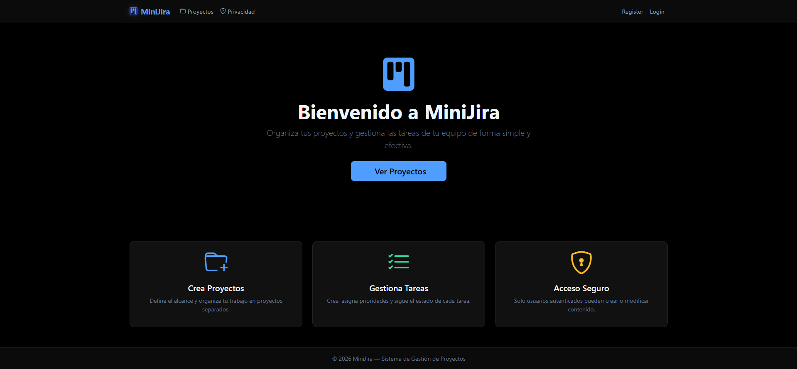
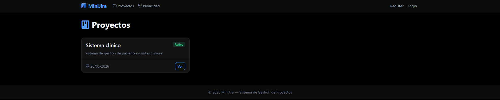
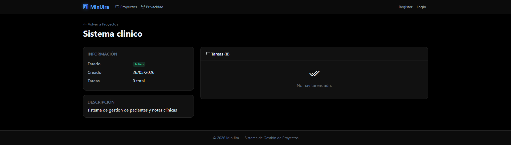
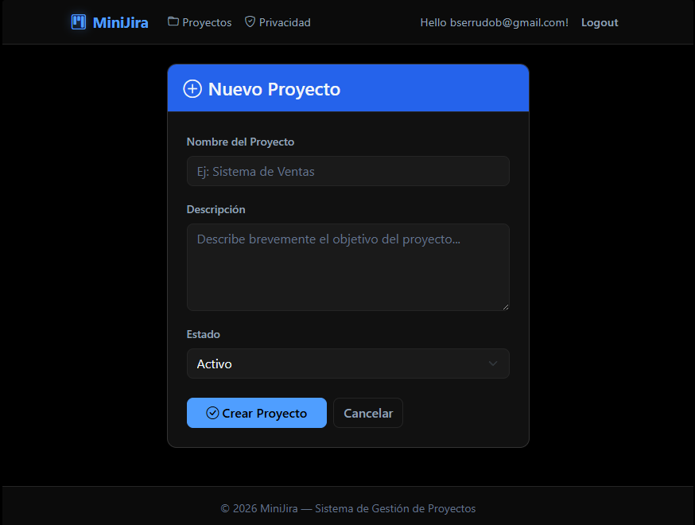
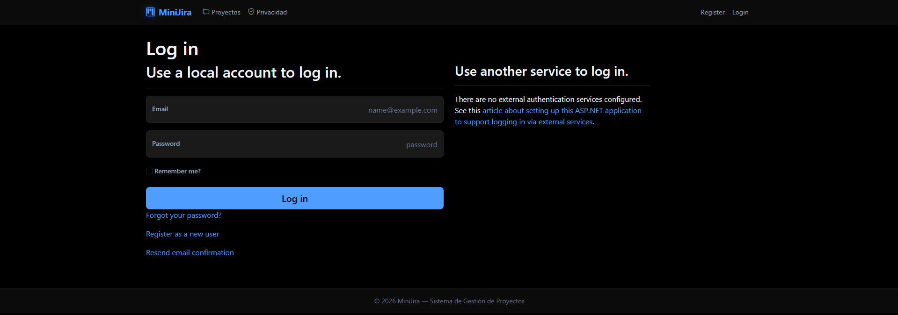

# MiniJira — Sistema de Gestión de Proyectos

Aplicación web desarrollada con **ASP.NET Core 9 MVC**, **Entity Framework Core** (Code-First) y **SQL Server**, implementando el **Patrón Repositorio** y **ASP.NET Identity** para autenticación.

---

## Requisitos previos

| Herramienta | Versión mínima |
|---|---|
| .NET SDK | 9.0 |
| SQL Server | Express / LocalDB 2019+ |
| dotnet-ef (CLI) | cualquiera |

### Instalar SQL Server LocalDB

1. Descarga el instalador desde: [https://aka.ms/sqllocaldb](https://aka.ms/sqllocaldb)
2. Ejecuta como administrador y sigue el asistente.
3. Verifica la instalación: `sqllocaldb info`

> **Nota:** Si solo tienes LocalDB v11.0 (SQL Server 2012), crea la instancia `MSSQLLocalDB` manualmente antes de ejecutar las migraciones:
> ```
> "C:\Program Files\Microsoft SQL Server\110\Tools\Binn\SqlLocalDB.exe" create MSSQLLocalDB
> "C:\Program Files\Microsoft SQL Server\110\Tools\Binn\SqlLocalDB.exe" start MSSQLLocalDB
> ```

### Instalar dotnet-ef CLI

```bash
dotnet tool install --global dotnet-ef
```

---

## Cómo levantar el proyecto

### 1. Clonar o descomprimir el repositorio

```bash
git clone <url-del-repo>
cd MiniJira
```

### 2. Configurar la cadena de conexión

En `appsettings.json`:

```json
{
  "ConnectionStrings": {
    "DefaultConnection": "Server=(localdb)\\mssqllocaldb;Database=MiniJiraDb;Trusted_Connection=True;MultipleActiveResultSets=true"
  }
}
```

Si usa SQL Server Express con instancia nombrada, reemplaza `(localdb)\\mssqllocaldb` por `.\SQLEXPRESS`.

### 3. Aplicar migraciones y crear la base de datos

```bash
dotnet ef database update
```

Esto crea automáticamente la base de datos `MiniJiraDb` con todas las tablas.

### 4. Ejecutar la aplicación

```bash
dotnet run
```

Accede en el navegador a: `https://localhost:5001` (o el puerto que indique la consola)

---

## Estructura del proyecto

```
MiniJira/
├── Controllers/
│   ├── ProyectosController.cs   ← CRUD proyectos + endpoint JSON
│   └── TareasController.cs      ← CRUD tareas + endpoint JSON
├── Data/
│   ├── ApplicationDbContext.cs  ← DbContext con Identity + entidades
│   └── Migrations/              ← Migraciones generadas por EF Core
├── Models/
│   ├── Proyecto.cs              ← Entidad Proyecto (1)
│   └── Tarea.cs                 ← Entidad Tarea (N) — FK: ProyectoId
├── Repositories/
│   ├── Interfaces/
│   │   ├── IProyectoRepository.cs
│   │   └── ITareaRepository.cs
│   └── Implementations/
│       ├── ProyectoRepository.cs
│       └── TareaRepository.cs
├── Views/
│   ├── Proyectos/  (Index, Create, Edit, Details, Delete)
│   ├── Tareas/     (Create, Edit)
│   └── Shared/     (_Layout, _LoginPartial)
├── Program.cs                   ← Configuración de servicios y middleware
└── appsettings.json             ← Cadena de conexión
```

---

## Endpoints API JSON

| Método | URL | Descripción | Auth requerida |
|--------|-----|-------------|----------------|
| GET | `/Proyectos/Api` | Lista todos los proyectos en JSON | No |
| GET | `/Tareas/Api?proyectoId={id}` | Lista tareas de un proyecto en JSON | No |

### Ejemplo de respuesta — `/Proyectos/Api`

```json
[
  {
    "id": 1,
    "nombre": "Sistema de Ventas",
    "descripcion": "Módulo de facturación electrónica",
    "fechaCreacion": "2026-05-25",
    "estado": "Activo",
    "totalTareas": 3
  }
]
```

---

## Características implementadas

- **Code-First** con Data Annotations y Fluent API
- **Patrón Repositorio** con interfaces e implementaciones concretas
- **Async/Await** en todos los métodos de acceso a datos
- **ASP.NET Identity** para login/registro de usuarios
- **[Authorize]** en creación, edición y eliminación
- **Tag Helpers** en todos los formularios Razor
- **Bootstrap 5 + Bootstrap Icons** para UI responsiva
- **TempData** para mensajes de confirmación entre redirecciones

---

## Capturas de pantalla

### Página de inicio


### Lista de proyectos


### Detalle de proyecto con tareas


### Formulario de creación de proyecto


### Login de usuario


---

## Brian Serrudo Beizaga

Desarrollo del examen UAP03 — DES320 Taller de Diseño de Aplicaciones.
